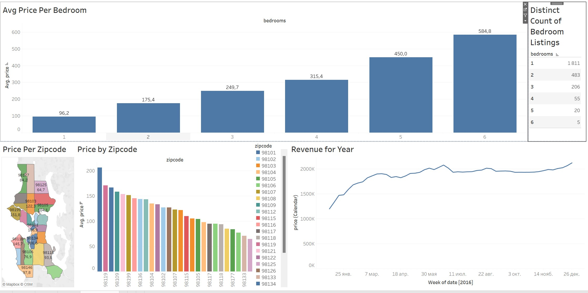

# Airbnb Tableau Dashboard
 
Визуализировал данные в программе Tableau, а именно:
1) Среднии цены по zipcode, в виде карты и диаграммы;
2) Количество обьявлений по количеству спален;
3) Выручка в течении года;
4) Средняя выручка за количество спален.
